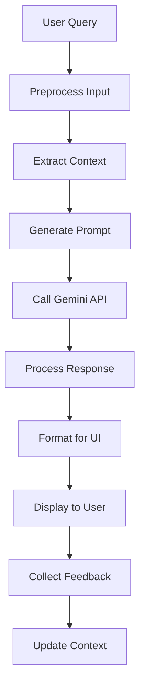

# 🤖 Gemini 2.5 Flash AI Chatbot Integration Plan

## Overview
This document outlines the comprehensive implementation plan for integrating the Gemini 2.5 Flash AI model as an error-resolution chatbot within the CollabCode platform.

## 1. System Architecture Design

### Frontend Components
- **Chat Interface Component** (`frontend/my-app/components/chatbot/ChatInterface.tsx`)
  - Real-time chat UI with message history
  - Input field for user queries
  - Display area for AI responses
  - Integration with existing UI theme

- **Chat Message Component** (`frontend/my-app/components/chatbot/ChatMessage.tsx`)
  - Individual message rendering (user/AI)
  - Support for markdown formatting
  - Code snippet highlighting
  - Action buttons for suggested commands

### Backend Services
- **Chatbot API Routes** (`backend/src/routes/chatbot.js`)
  - `/api/chatbot/query` - Handle user queries
  - `/api/chatbot/history` - Retrieve chat history
  - `/api/chatbot/feedback` - Collect user feedback

- **Gemini Service** (`backend/src/services/geminiService.js`)
  - API connection management
  - Request/response handling
  - Rate limiting and retry logic
  - Prompt engineering and context management

- **Error Analysis Service** (`backend/src/services/errorAnalysisService.js`)
  - Error detection and classification
  - Context extraction from terminal outputs
  - Log analysis and pattern matching

### Data Models
- **Chat Session** (`backend/src/models/ChatSession.js`)
  - Session management
  - Message history storage
  - User context tracking

## 2. API Connection Strategy

### Authentication & Security
```javascript
// Environment variables
GEMINI_API_KEY=your_api_key_here
GEMINI_API_ENDPOINT=https://generativelanguage.googleapis.com/v1beta/models/gemini-2.5-flash-latest:generateContent
```

### Request Structure
```javascript
const geminiRequest = {
  contents: [{
    parts: [{
      text: promptWithContext
    }]
  }],
  generationConfig: {
    temperature: 0.7,
    topK: 40,
    topP: 0.95,
    maxOutputTokens: 1024
  },
  safetySettings: [
    // Configure safety settings
  ]
};
```

### Rate Limiting Strategy
- Implement exponential backoff
- Queue management for concurrent requests
- User-based rate limiting
- Graceful degradation on API limits

## 3. Error Detection and Analysis Framework

### Input Processing Pipeline
1. **Query Preprocessing**
   - Extract error codes and stack traces
   - Identify programming language context
   - Normalize whitespace and formatting

2. **Context Enrichment**
   - Current project files and structure
   - Recent terminal command history
   - Error logs and stack traces
   - Package.json dependencies

3. **Prompt Engineering**
```javascript
const systemPrompt = `
You are an expert coding assistant specializing in error resolution.
Analyze the following error and provide a clear, actionable solution.

Context:
- Project Type: ${projectType}
- Programming Language: ${language}
- Recent Commands: ${recentCommands}
- Error Details: ${errorDetails}

Provide:
1. Root cause analysis
2. Step-by-step solution
3. Prevention tips
4. Relevant code examples
`;
```

### Error Classification
- **Syntax Errors**: Missing semicolons, brackets, etc.
- **Runtime Errors**: Null pointer exceptions, type errors
- **Build Errors**: Compilation failures, missing dependencies
- **Environment Errors**: Path issues, permission problems
- **Logic Errors**: Incorrect algorithm implementation

## 4. Response Generation and User Interaction

### Response Processing
1. **Parse AI Response**
   - Extract solution steps
   - Identify code snippets
   - Detect actionable commands

2. **Format for Display**
   - Markdown rendering
   - Syntax highlighting
   - Interactive elements

3. **Action Integration**
   - "Run Command" buttons
   - "Apply Fix" suggestions
   - "Copy Code" functionality

### Conversation Flow


### Fallback Mechanisms
- Generic error handling responses
- Escalation to documentation links
- Community forum integration
- Human support handoff

## 5. Testing Strategy

### Unit Tests
- **Gemini Service Tests**
  - API request formatting
  - Response parsing
  - Error handling
  - Rate limiting logic

- **Error Analysis Tests**
  - Error pattern recognition
  - Context extraction accuracy
  - Classification correctness

### Integration Tests
- **End-to-End Flow**
  - User query → AI response
  - Context passing between services
  - Database operations

- **API Integration**
  - Gemini API connectivity
  - Authentication handling
  - Response validation

### Performance Tests
- **Response Time Benchmarks**
  - Target: <3 seconds for simple queries
  - Target: <10 seconds for complex analysis

- **Load Testing**
  - Concurrent user handling
  - API rate limit compliance
  - Memory usage optimization

### User Acceptance Testing
- **Error Resolution Accuracy**
  - Test with known error scenarios
  - Measure solution effectiveness
  - User satisfaction metrics

- **UI/UX Testing**
  - Chat interface usability
  - Response readability
  - Action button functionality

## 6. Implementation Phases

### Phase 1: Core Infrastructure (Week 1)
- [ ] Set up Gemini API connection
- [ ] Create basic chat interface
- [ ] Implement message storage
- [ ] Basic error detection

### Phase 2: AI Integration (Week 2)
- [ ] Prompt engineering
- [ ] Context extraction
- [ ] Response processing
- [ ] Error classification

### Phase 3: Advanced Features (Week 3)
- [ ] Interactive responses
- [ ] Command execution integration
- [ ] Conversation memory
- [ ] Feedback collection

### Phase 4: Testing & Optimization (Week 4)
- [ ] Comprehensive testing
- [ ] Performance optimization
- [ ] Security hardening
- [ ] Documentation

## 7. Security Considerations

### API Security
- Secure API key storage
- Request/response encryption
- Input sanitization
- Output validation

### Data Privacy
- User query anonymization
- Sensitive data filtering
- GDPR compliance
- Data retention policies

### Rate Limiting
- Per-user quotas
- API usage monitoring
- Abuse prevention
- Cost management

## 8. Monitoring and Analytics

### Key Metrics
- Response accuracy rate
- User satisfaction scores
- API usage and costs
- Error resolution success rate

### Logging Strategy
- User interactions
- API requests/responses
- Error occurrences
- Performance metrics

### Alerting
- API failures
- High error rates
- Performance degradation
- Cost threshold breaches

## 9. Future Enhancements

### Advanced Features
- Multi-turn conversations
- Code generation capabilities
- Project-specific learning
- Integration with external tools

### Scalability
- Microservices architecture
- Caching strategies
- Load balancing
- Database optimization

---

## Getting Started

1. **Prerequisites**
   - Gemini API access and key
   - Node.js environment
   - MongoDB database
   - Docker (for containerization)

2. **Installation Steps**
   ```bash
   # Install dependencies
   cd backend && npm install @google/generative-ai
   cd frontend/my-app && npm install react-markdown
   
   # Set environment variables
   echo "GEMINI_API_KEY=your_key_here" >> backend/.env
   
   # Run tests
   npm test
   ```

3. **Development Workflow**
   - Create feature branches
   - Write tests first (TDD)
   - Code review process
   - Continuous integration

This plan provides a comprehensive roadmap for implementing the Gemini 2.5 Flash AI chatbot integration. Each phase builds upon the previous one, ensuring a robust and scalable solution.